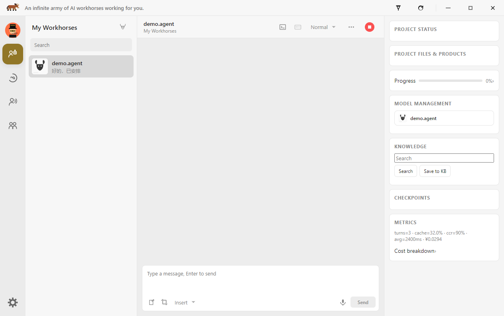
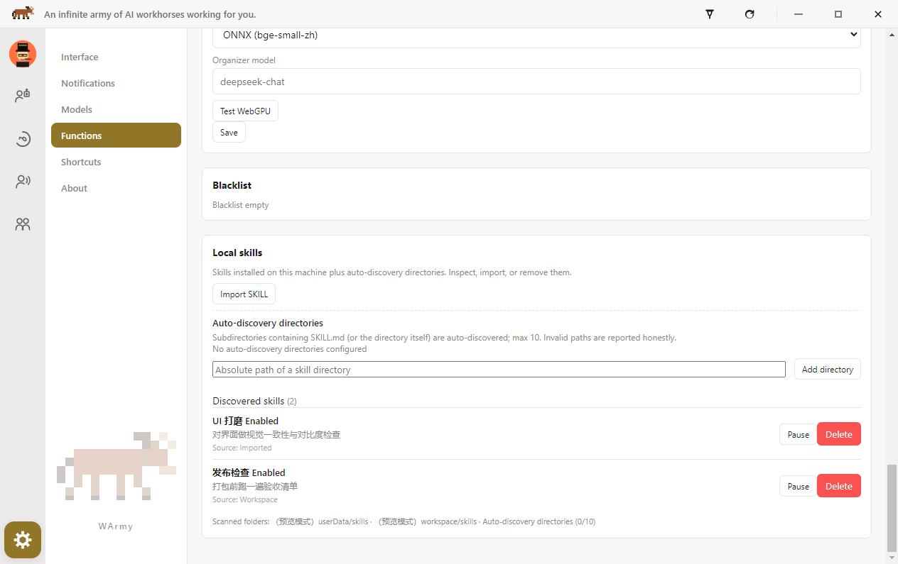
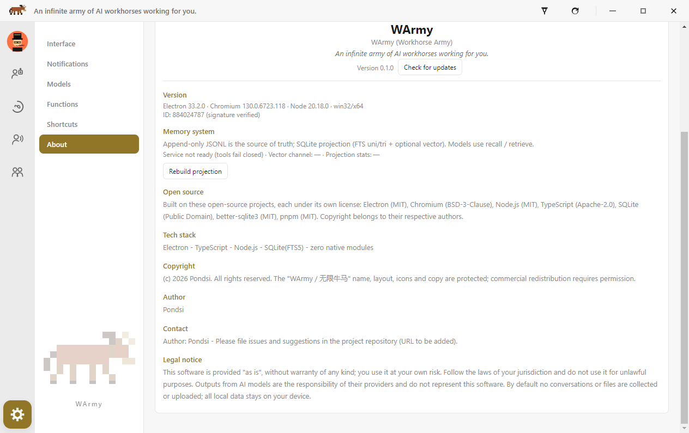

# WArmy

> **简体中文完整说明请点这里 → [说明.md](./说明.md)**

**Workhorse Army** · **无限牛马**

> An infinite army of AI workhorses working for you.

[](https://github.com/Pondsi/WArmy/releases/tag/v0.1.0)
[](./LICENSE)
[](https://github.com/Pondsi/WArmy/releases)
[](https://www.electronjs.org/)
[](https://nodejs.org/)
[](#internationalization)
[](#memory-system)
[](https://github.com/Pondsi)

**WArmy** is a **local-first multi-agent group-chat desktop app**.
Create AI **workhorses** (agents), put them into **project groups**, and let a **duty agent** orchestrate tools, a task board, **bounded context**, and a **local memory service** — while chats and files stay on **your device** by default.

Chinese product name: **无限牛马** (ja: 無限社畜 / ko: 무한 사축).  
**Full Chinese manual:** [说明.md](./说明.md) — 详细中文说明请直接看该文件（本 README 以英文为主入口）。



| Home (English) | Settings · Functions / Skills | About / Memory |
| --- | --- | --- |
|  |  |  |

---

## What makes WArmy different

1. **Group is the product surface** — My workhorses / Projects / Contacts & groups / Overview board.
2. **Duty, not shouting** — duty is local-only; order-based dispatch; directed `@`; P0–P3 queues **persisted and never dropped**.
3. **Memory system is a first-class feature** — append-only **JSONL** as source of truth; SQLite projection rebuildable; **FTS unigram + trigram + vector (RRF)** recall; model tools `recall` / `retrieve`; chat logs restored on boot.
4. **Container = development isolation** — no silent host fallback; solidify only after real commit + image inspect.
5. **Ports that refuse to lie** — production **59599** (dev 58588 / test 62666); bind failure never silent.

### Compared with similar open-source projects

| Genre | Typical strength | How WArmy differs |
| --- | --- | --- |
| Agent prompt packs (agency-agents style) | Personas & recipes | WArmy is a **running desktop product** |
| Single-window chat UIs | Simple model chat | Unit of work is **group + duty + board + memory + policy** |
| Coding-agent CLIs / IDE plugins | Deep repo editing | WArmy is a **project command center**, not an IDE plugin |
| Multi-agent frameworks | Code-first orchestration | WArmy ships **UI + persistence + security gates** out of the box |
| Desktop agent runtimes (OpenClaw / dsh-class) | Strong local execution | WArmy adds **group semantics + memory + container policy** |
| Container platforms | Container UX | WArmy **probes user-installed runtimes**, does not bundle Docker Desktop |

**Pitch:** other stacks give you *an agent*, *a chat*, or *a library*. **WArmy gives you an army with ranks, duty, projects, memory, and a sandbox door that stays shut.**

### Features

- Multi-instance workhorses (persona, fallback chain, hardware advice)
- Project / contact / external groups (external reply **only on @**)
- Duty orchestration, board commands, checkpoints, knowledge base
- **Bounded context renderer** + **local memory-os** (JSONL/FTS/vector)
- Container-dev projects + project file ledger (member-visible)
- Mesh identity / membership / `WARMY-*` protocol constants
- **10 UI locales** with equal key sets

---

## Memory system

WArmy’s memory is **not** “chat history in a folder”. It is an explicit L2 service:

| Layer | Role |
| --- | --- |
| `fast-memory.jsonl` | **Append-only source of truth** (single writer per store) |
| `memory.db` (SQLite + FTS5) | **Disposable projection**, fully rebuildable from JSONL |
| `fts_uni` | CJK-aware unigram FTS |
| `fts_tri` | Trigram FTS for ASCII ids / paths / error codes |
| Vector channel | Optional bge-small int8 embeddings inside authorized scope |
| RRF fusion | Fuse channels → index cards |

**Model tools:** `recall(query)` discovers evidence cards; `retrieve(seq\|recordId)` dereferences **byte-accurate** history (pointers stay small).

**Runtime facts**

- Native `better-sqlite3` stays in a **child process** (Electron main/renderer stay zero-native-module).
- Boot restores chat logs from memory JSONL.
- Data dir default: app user-data `memory/` (override env **`WARMY_MEMORY_DIR`**).
- If the service is down, tools **fail closed** with honest text — they do not invent history.

Deep dive: [`references/ARCHITECTURE.md`](./references/ARCHITECTURE.md) · verify: `node packages/app-shell/scripts/verify-memory.mjs`

---

## Install

### Windows

1. [Releases v0.1.0](https://github.com/Pondsi/WArmy/releases/tag/v0.1.0) → **`WArmy-Setup-0.1.0.exe`**  
   Direct: [WArmy-Setup-0.1.0.exe](https://github.com/Pondsi/WArmy/releases/download/v0.1.0/WArmy-Setup-0.1.0.exe)
2. Optional SHA-256 vs [`checksums.txt`](./checksums.txt)
3. Launch **WArmy / 无限牛马** → Settings → language / providers

### Source

```bash
git clone https://github.com/Pondsi/WArmy.git
cd WArmy
pnpm install
pnpm -r build
pnpm --filter @warmy/app-shell start
```

Node.js **>= 24**, **pnpm** (repo pins `pnpm@10.23.0`).

Bundled Node runtime (optional, for packaging / memory child):

```bash
node scripts/fetch-node-runtime.mjs
```

See also [CONTRIBUTING.md](./CONTRIBUTING.md).

---

## How to use

1. **My agents** → create workhorse → provider + model → start  
2. **Projects** → create group → host or **container** development  
3. Send with **P1 / P2 / P3** urgency (queues persist)  
4. Right panel: files, products, progress, metrics  
5. Settings → Language (10 packs) · Settings → container probe / mesh / identity  

**Container-dev:** development isolation only; not ready ⇒ grey console, no host fallback; stop ≈ creator-offline for members; history readable.

### Ports

| Constant | Default |
| --- | --- |
| Production mesh TCP | **59599** |
| Dev / test convention | 58588 / 62666 |

---

## Security & privacy

- Default: **no collection/upload** of conversations and files  
- Secrets env scrubbed before container commands  
- Honest limits: bind-mount host visibility is by design; ACL lock ≠ encryption; public NAT needs a second machine  

---

## Technical highlights

| Area | Approach |
| --- | --- |
| Shell | Electron 33 + TypeScript; zero native modules in main/renderer |
| Memory | JSONL truth + SQLite/FTS/vector projection + recall/retrieve tools |
| Context | Bounded renderer + pointers |
| Router | Duty machine + persistent queues |
| Mesh | Ed25519 identity, `WARMY-*` constants |
| Verify | i18n / wiring / protocol / container / router / memory / docs / CDP UI |

---

## Quality gates

```bash
node packages/app-shell/scripts/verify-i18n-locales.mjs
node packages/app-shell/scripts/verify-router-queue.mjs
node packages/app-shell/scripts/verify-wiring.mjs
node packages/app-shell/scripts/verify-container-probe.mjs
node packages/sync-protocol/scripts/verify-connectivity.mjs
node packages/app-shell/scripts/verify-memory.mjs
node packages/app-shell/scripts/verify-docs.mjs
```

---

## Internationalization

zh-CN · zh-TW · en-US · ja · ko · ru · es · fr · pt · eo — equal key sets.

Product nav naming: zh `我的牛马` · ja `マイ社畜たち` · ko `일꾼들` · others `My Workhorses`. See [docs/i18n-naming.md](./docs/i18n-naming.md).

---

## Repository layout

```text
WArmy/
├── README.md  说明.md  LICENSE  SPONSORS.md  CHANGELOG.md  CONTRIBUTING.md
├── checksums.txt  index.html
├── docs/  references/  packages/  sponsors/  spikes/
```

---

## Languages / 语言

- **English** — this file (primary).
- **简体中文** — full manual: [说明.md](./说明.md)
- Other locales — install/safety text is semantically equivalent to English; UI ships 10 packs in-product.

<details>
<summary>繁體中文 / 한국어 / Русский / 日本語 / Español / Français / Português / Esperanto（摘要）</summary>

WArmy is a local-first multi-agent group-chat desktop app. Install from GitHub Releases (`WArmy-Setup-0.1.0.exe`) or build with pnpm. Full Chinese manual: [说明.md](./说明.md). Details are equivalent to the English sections above.

</details>

---

## License & sponsors

[LICENSE](./LICENSE) · [SPONSORS.md](./SPONSORS.md) · security: [.github/SECURITY.md](./.github/SECURITY.md) · mesh checklist: [docs/mesh-dual-machine.md](./docs/mesh-dual-machine.md)

---

Pondsi (+mimo-X-pro-Preview +mimo-v2.5-pro +DeepSeek-V4.1-Flash +Qwen3.7-max +Qwen3.8-27b +Gemini3.1pro +Gemini3.8-flash) — automatically committed by Xiaomi MiMo Desktop
