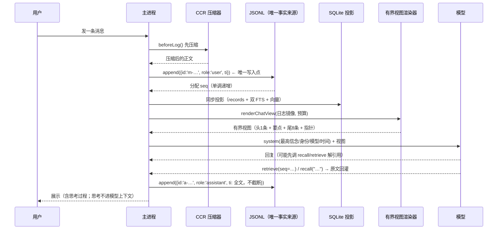

# 需求文档 · 记忆系统（WArmy）

> 状态：**已实现**（截至 v0.2.6）。本文分两半：**上半是需求与流程**（用户视角：它应该怎么工作），
> **下半是技术实现**（工程师视角：代码在哪、数据长什么样、边界怎么守）。
> 关键代码：`packages/memory-os/`（记忆服务本体）、`packages/app-shell/src/memory-client.ts`（主进程客户端）、
> `packages/app-shell/src/context-renderer.ts`（有界视图渲染器）、`archive-cleanup.ts`、`project-memory.ts`、`knowledge-base/`、`ccr-compressor/`
> 门禁：`verify-memory.mjs`、`verify-context-renderer.mjs`、`verify-history-persist.mjs`

---

# 第一部分：需求与流程（它该怎么工作）

## 1. 一句话定位

**记忆系统 = 一份只追加的本机日志（唯一事实来源）+ 一层可以随时丢掉重建的检索投影 + 一个"有界视图"渲染器。**
它保证三件事：**不丢**（历史永远在日志里）、**有界**（喂给模型的上下文永远不超过预算）、**可解引用**（被挤出去的内容还能被取回来）。

## 2. 产品层面的硬要求（不变量）

| # | 要求 | 为什么 |
|---|---|---|
| 1 | **只追加**：日志写入后不修改（唯一例外是用户显式回退到检查点） | "我说过的话"不能被悄悄改写；崩溃不丢已写内容 |
| 2 | **有界视图**：喂给模型的视图字符数恒 ≤ 预算，与日志总长**解耦** | 日志可以千万字，上下文不能 |
| 3 | **绝不给空视图** | 真事故：预算缩太小把 6 条历史全省略、只剩一根指针 ⇒ 模型说"这是咱们对话的第一条消息"，用户以为它失忆 |
| 4 | **指针必须完整可执行** | 被省略的内容要靠指针取回；半截指针等于取不回 |
| 5 | **JSONL 是唯一事实来源**，SQLite 只是投影 | 投影坏了可重建；投影与日志冲突时**以日志为准** |
| 6 | **写入者唯一**（`duty` / `router` / `memory-service` / `executor`） | 多路写 = 双源 = 同一句话显示两遍 |
| 7 | **权限先于相关性** | 检索先在作用域内过滤（这个会话/这个项目），再谈排序 |
| 8 | **CCR 压缩先于入日志** | 日志是长期的，进去之前先瘦身 |
| 9 | **宁可如实说"不可用"，也不编造**：服务没起来、向量模型缺失、投影缺行，一律如实上报并降级 | 假成功比失败更糟 |
| 10 | **主进程与渲染进程零原生 `.node` 依赖** | 记忆服务的原生依赖（better-sqlite3）只活在独立子进程里 |

## 3. 一次对话里，记忆发生了什么（流程）



**要点**：
- 日志写入在**发模型之前**（这样即使模型调用失败，用户那句话也已经落盘）。
- 工具结果**不进记忆**（只回模型，且有 4000/12000 字符限额）—— 记忆是"对话事实"，不是"运行噪声"。
- 助手回复**全文入库、不截断**（历史 bug 曾 `slice(0,4000)`，导致 retrieve 取不回尾巴）。
- 思考过程、系统小字、"本轮模型"这些**只给界面看**，永不进模型上下文。

## 4. 上下文不够用的时候怎么"记得住"

预算不够时，渲染器**不丢内容，只丢"逐字原文"**：把中间那段换成一段压缩要点 + **三种冗余线索的可执行指针**：

```
[省略 37 条 user/assistant，seq 11..48，共 8,412 字]
如需原文，可调用 retrieve(seq=11) / retrieve(recordId="m-1759…") / recall("<语义线索>") 取回原文。
```

- **seq 范围** → `retrieve({seq})` 精确命中（覆盖整段）
- **recordId 采样**（段首 4 + 段尾 4，最多 8 个）→ `retrieve({recordId})` 直取某条
- **语义线索** → `recall("…")` 语义/关键词召回

三种线索**故意冗余**：任何一条坏了，另外两条还能把内容取回来。

## 5. 归档与知识（长期记忆）

- 归档一个会话时，**不只是存一份摘要**，还要：抽取**实体/事件**进知识库、抽取**使用者偏好**（对"我"的长期认知）、生成**结构化摘要**（要点/决策/待办/风险）。
- 清理有明确上限（见 §13），不无限膨胀。

## 6. 优先级：谁的话最算数

`agents.md`（最高信念，用户可编辑）> 身份/模型/时间等 system 段 > **项目记忆**（项目规矩/目标，在值班者系统提示里）> 有界视图（对话历史）。

---

# 第二部分：技术实现

## 7. 数据分层（谁是什么）

| 层 | 位置 | 格式 | 角色 |
|---|---|---|---|
| **唯一事实来源** | `userData/memory/fast-memory.jsonl` | 一行一条 JSON（append-only） | 不可丢；seq 单调 |
| **检索投影** | `userData/memory/memory.db`（WAL） | SQLite：`records` + `fts_uni` + `fts_tri` + `vec_index`（schema v2） | **可丢可重建**：库空而日志有 ⇒ 冷启动全量重建 |
| **服务运行时** | `userData/memory-runtime/`（`index.js`/`ipc.js`/`embedder.js`/`tokenizer.js`） | 编译产物副本 | 主进程 `fork` 它，避免打包路径问题 |
| **进程内镜像** | `chatLogs`（Map）+ 派生 `chatHistories` | 内存 | 界面与注入的快速读取；**与日志同源** |
| **归档** | `userData/archive/archives.jsonl` | JSONL | 摘要 + structured 要点 |
| **知识库** | `userData/knowledge/knowledge.json` | JSON | 实体/事件/关系 |
| **偏好** | `userData/user-preferences.json` | JSON | 跨会话说"我是谁/我喜欢怎样" |
| **检查点** | `userData/checkpoints/{checkpoints.json, shadows/<id>/}` | JSON + 快照目录 | 回退用（rollback 是**唯一允许改写日志**的例外） |
| **最高信念** | `userData/agents.md` | Markdown | 优先级最高的指令 |

## 8. 写入路径

```
用户消息：
  CCR beforeLog({kind:'message'})            → ccr-compressor
  → memory.append({id:'m-<ts>-<n>', sessionId, kind:'message', role:'user', ti})
  → 服务端 ++seq 落 JSONL（index.ts:416）    → 同步投影（records + fts_uni + fts_tri [+ 向量]）
  → 用返回的 seq 写日志镜像（electron-main.ts:4176）
助手回复：同形状，role:'assistant'，**正文不截断**
工具结果：不进记忆（只回模型；受 4000 字/条、12000 字/轮限额）
```

- **角色还原契约**：SQLite 投影的 `tail()` **读不到** JSONL 里的额外字段，所以角色**只靠 recordId 前缀还原**（`a-…` = assistant，`m-…` = user；`memory-client.ts:510-522`）。重建历史时按前缀判定，不依赖投影。
- **seq 分配**：服务端 `meta.last_seq` 持久化计数（`index.ts:288,446`）；主进程用返回的 seq 对齐（`xiaYiLiaoTianXuLie(memSeq)`），服务不可用时退化为本地 +1。
- **去重**：同 `role + content` 且间隔 < 3 秒 ⇒ 跳过（同一句话有两条写入路径）；role 先归一成 `user`/`assistant`；recordId 带单调后缀，防同毫秒撞 UNIQUE id。
- **写入者白名单**：`duty | router | memory-service | executor`；**executor 写 `kind:'message'` 会被拒**（`index.ts:411-414`）—— 记忆里只有对话事实。
- **写入失败不挂 recordId**（`electron-main.ts:4155`）：宁可没有指针，也不要"指向不存在的记录"的假指针。

## 9. 读取路径（有界视图）

**唯一入口**：`renderChatView()` → `xuanranYoujieShitu()`（纯函数、零 LLM、无副作用）。

**预算怎么算**（`youPeizhiSuanShangXiaWenYuSuan`）：
```
预算 chars = min(200000, max(200, tokens × 1.6))
tokens    = max(2048, round(百分比 × 模型窗口))
百分比     = settings.contextBudgetPercent（默认 60%，夹 10..90），
            并不低于 minPercent = ceil(2048 / 模型窗口 × 100)   ← 保证至少装得下最小可用上下文
模型窗口   = 已知表（deepseek 64k、mimo 128k、qwen3.8 32k…）或 settings.modelContextTokens 覆盖
```
外加 `settings.contextBudgetChars` 可直接指定绝对预算。

**渲染参数**：`keepHead = 1`（系统提示冻结，保 KV Cache 前缀稳定）、`keepTail = 8`（近期对话原文）、
要点最小份额 `DIGEST_MIN_SHARE = 25%`（否则"要点被头尾挤到只剩几十字符"= 有界成立但压缩白做）。

**逐级降配顺序**（先牺牲谁，写在代码里）：
1. 先保"头尾 + 要点份额"的最优解（`total` 从大到小搜第一个满足的）；
2. 不行就降指针档位（`full` → `compact` → `min`）；
3. 再不行缩 `keepTail`，**最后**才缩 `keepHead`；
4. 仍然超 ⇒ `yingQianzhi()` 硬裁剪；
5. **硬断言**：`viewBytes ≤ budgetChars`（不允许抛错，用裁剪落地）；
6. **绝不给空视图**：日志非空 ⇒ 至少把最后一条真实消息带给模型。

**指针结构**（`zhizhenQianzhui`）：`[省略 N 条 <角色>，seq A..B，共 X 字]` + 三线索；
`ElidedRange.recordIds` 是**有界采样**（段首 4 + 段尾 4，上限 8），完整性由 seq 范围 + recall 保证 —— 否则渲染代价随日志条数线性放大。

**上下文超限自动收缩**：模型报 context 类错误时按 `1.0 → 0.6 → 0.35 → 0.2` 相对预算重试（`daiShangXiaWenChongShiYunXing`），到底仍失败则**如实告知**"该模型上下文太小"，不再无限重试。

## 10. 记忆服务本体（memory-os）

- **进程**：主进程 `fork(userData/memory-runtime/ipc.js)`，用**捆绑 Node**（`nodePath`），env 传 `WARMY_MEMORY_DIR`；
  启动超时 10 秒；**stdout/stderr 必须有人读**（不然管道写满 64KB 会把子进程卡死在写操作上，启动必超时）——读进**有界 12 行**缓冲，退出时写进启动日志，便于看崩溃原因。
- **协议**：`{id, op, …}` → `{id, …}`（child_process IPC）；方法：`append / tail / recall / recall_sync / retrieve / rebuild / vector_status / hydrate / stats / embed / shutdown`。单次调用 8 秒超时。
- **索引三通道**（RRF 融合，k=60）：
  | 通道 | 分词 | 擅长 |
  |---|---|---|
  | `fts_uni` | CJK 字符间插空格 → 单字索引（`unicode61`） | 1–2 字的短查询 |
  | `fts_tri` | trigram（≥3 字符才可查） | ASCII 标识符/错误码/路径、≥3 字 CJK 子串 |
  | `vector` | bge-small-zh-v1.5（ONNX int8, 512 维，纯 WASM） | 语义相近但用词不同 |
  - 向量**可选**：没有模型文件就跳过这一腿并**如实报因**；余弦下限 0.5（实测分界：真实语义查询 top1≈0.68、乱码≈0.447）；query 的 `[UNK]` 占比 > 0.5 也跳过（此时稠密向量不可信）。
- **权限先于相关性**：作用域先物化成 `TEMP` 表 `scope_filter_<fnv1a>`，三个通道都 `JOIN` 它。
- **fail-closed**：服务未就绪/不可用 ⇒ 工具返回**可读的说明文本**、绝不抛错；模型因此知道自己"取不到"，而不是被喂空数据。投影缺行时回读 JSONL 原文（`971-995`）。

## 11. 模型可用的两个解引用工具

| 工具 | 参数 | 说明 |
|---|---|---|
| `recall` | `{ query, limit ≤ 20 }` | 语义+关键词召回，返回**卡片**（命中片段 + 出处） |
| `retrieve` | `{ recordId 或 seq, offset?, maxChars ≤ 8000 }` | 精确取回原文（`huiTui: exact/nearby/fuzzy`） |

- 单次结果上限 **4000 字符**（`JIYICANG_GONGJU_JIEGUO_ZISHU`），一次最多 **20 张卡**，query 最长 **8000 字符**。
- **回灌形式**：卡片列表 + 一句提示；**非 exact 命中会强制告警**（告诉模型"这是附近/模糊匹配，不是原文"）—— 不许把"相似"说成"就是"。

## 12. 项目记忆与最高信念

- **项目记忆**：事实源是 `GroupRecord.project.memory`（`groups.json`）；读取上限 8000 字，**注入上限 1200 字**（超限明确标注截断）；注入到值班者的系统提示与执行者 `contextItems`。
- **最高信念**：`userData/agents.md`，在 chat-send 路径**强制注入为首条 system** 并声明最高优先级。**未确认**：群/值班路径是否也注入（调研未在那些分支看到注入点）。

## 13. 归档、知识与清理

| 项 | 触发/上限 |
|---|---|
| 归档 | `warmy:guiDangWaiBu`；会话摘要 `warmy:huiHuaZhaiYao` 取**末 30 条** |
| 提取 | 纯规则（regex，零 LLM）：实体/事件/偏好 + 要点/决策/待办/风险 |
| 落点 | `archive/archives.jsonl`、`knowledge/knowledge.json`、`user-preferences.json`（按 key 去重，上限 200） |
| 检查点 | 默认保留最近 **20** 个（可配），硬上限 50 个 / 512MB |
| 语音文件 | 超过 **7 天**清理 |
| 审计日志 | 由用户显式"清空" |

## 14. 崩溃恢复

- 冷启动重建：库空而 JSONL 有 ⇒ 全量重建投影；`tail(400)`（约 40 万字符窗）把最近历史拉回内存镜像。
- 更早的历史**不常驻内存**，只能靠指针 `retrieve` 取。
- 记忆服务崩了/起不来：**对话照常可用**（只是模型暂时没有解引用能力），并且启动日志里能查到子进程最后 12 行输出。

## 15. 相邻机制（同属"别忘事"的一族）

- **CCR 压缩**：写入侧（`tool_result` 优先、`message` 预算 ×4）与渲染侧串联，规则型、零 LLM。
- **read-back 回读**：写后回读校验，不匹配**不许说"已保存"**。
- **资产治理**：会话产生的文件/附件按 project/session 检索（`zhuCeLiaoTianZiChan`）。
- **检查点回退**：全量快照 + 可 rollback 回写日志 —— 与"只追加"**存在张力**，属**显式例外**（用户主动回退才发生）。

## 16. 已知风险 / 未接线（如实记录）

1. `records.groupId / entityType` 列已建，但 `append` **从未传值** ⇒ 作用域目前实际主要按 `sessionId` / `kind` 生效（跨项目检索的精细度受限）。
2. `lock.ts` 的 `JsonlSuo`（SWMR 文件锁）**已导出但未实例化** ⇒ JSONL 的读者/写者并发保护目前靠"唯一写入者"约定，而非文件锁。
3. 检查点回退会改写 `fast-memory.jsonl` ⇒ 与"只追加"不变量冲突（见 §15 的显式例外说明）。

## 17. 验收（门禁在断言什么）

| 门禁 | 断言的主题 |
|---|---|
| `verify-memory.mjs` | 静态：三路召回都在、唯一事实源、env 传递；动态：`append → recall(sync/async) → retrieve → rebuild → 作用域隔离 → 写入者白名单拒绝`；**无原生 sqlite 时如实 skip（skip ≠ 缺陷）** |
| `verify-context-renderer.mjs` | 解耦（视图大小与日志长度无关，方差 0）、恒 ≤ 预算、三线索指针、`recordId/seq/recall` 三条路都能**逐字节**取回原文、`keepHead/keepTail` 保真、200 字极端预算退化、预算扫描 / 脏输入 / 压缩器抛错都不抛、真 Electron 跑 24 轮、`metrics.viewBounded` |
| `verify-history-persist.mjs` | 唯一写入点、日志与 JSONL **逐条 sha256 一致**、重启重建（maxSeq 一致、角色由 id 前缀还原）、注入内容逐字节包含旧消息、新 seq 严格递增、**记忆服务坏掉仍能对话** |
