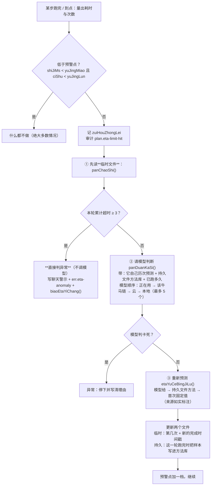

# 需求文档：行为级的「预计完成时间 + 轮次/时间上限」

> 状态：**已实现**（v0.2.6）。本文既是需求说明，也是技术实现方案与验收依据。
> 相关代码：`packages/app-shell/src/eta-forecast.ts`、`packages/app-shell/src/electron-main.ts`（`chaXingWei` / `panDuanKaSi` / `yanXuJiHuaRenWu`）
> 相关门禁：`packages/app-shell/scripts/verify-eta-forecast.mjs`（53 项）
> 数据文件：持久 `userData/eta.json`、临时 `userData/eta-live.json`

## 1. 需求原文拆解（用户原话 → 可执行条目）

| # | 用户要求 | 落地做法 |
|---|---|---|
| 1 | 每轮对话 / 工具使用 / 等待回复 / 等待某个行动完成，**都有**预计完成时间与轮数限制 | 五类"行为"各有两把尺子：`duiHua` / `gongJu` / `dengDaiHuiFu` / `dengDaiXingDong` / `ziDongXuPai` |
| 2 | 首次的时间与次数是**固定的**，并要联网查资料确定合理值、判断不同行为是否该不同 | 见 §2 表：每个数字都有官方来源；**刻意分档**（读文件 ≠ 跑构建 ≠ 等云模型） |
| 3 | 次数到或限时到 ⇒ **调用模型判断**；优先用该任务正在用的模型，无反应就按**该牛马的调用链**换；**5 个都没反应算异常** | `panDuanKaSi()` 候选顺序：正在用的 → 该牛马 `chain`（`lianMingOf`）→ 云端（有 Key）→ 本地；`PAN_MO_XING_SHANG_XIAN = 5` |
| 4 | **每次模型判断前先看临时配置文件** | `chaXingWei()` 里 `etaHuo().panChaoShi(sessionId, xingWei)` 是第一件事（在 `panDuanKaSi` 之前） |
| 5 | 同一轮已超 3 次预测时间 ⇒ **直接判异常，不再预测** | `chao.yiChang` ⇒ 写聊天警示 + 审计 + `biaoEtaYiChang()`，**不调模型** |
| 6 | 没到 3 次 ⇒ 模型判断；判"没卡死"就**重新预测**（按持久文件里的预测方法；没有方法就自己预测并把新方法写进持久文件） | `etaYuCeBingJiLu()`：模型给 → `etaCang().yuCeByFangFa()` → 首次固定值；每轮结束 `xueXi()` 把方法写回持久文件 |
| 7 | 临时文件存**本轮本次预测完成时间的时间戳**；同一轮有过超时就必须存在，并记录上次预测完成时间；比当前时间判断是否超出 | `EtaLinShi`：`shangCiYuCe.jieZhiMs`（绝对时刻）；`chaoShiCiShu` / `lianXuChaoShi` / `liCi[]`；**每次变更立即落盘** |
| 8 | 没超 3 次 ⇒ 让模型更新预测时间，**同时更新持久与临时两个文件** | `jiYuCe()`（临时）+ `jiFangFa()`（持久） |
| 9 | 存下来的**不是简单一个时间**，要复杂丰富、覆盖各种情况，并在使用中**自我完善** | 见 §3 数据结构：时长 + 绝对时刻 + 依据 + 来源 + 模型 + 结论回填；方法库按"行为 × 任务签名"聚类，带中位/90 分位/偏移系数/命中率/样例 |

## 2. 首次固定值（每个数字都有出处）

> 调研结论（有链接的官方来源）：
> * 轮次上限：**OpenAI Agents SDK** `DEFAULT_MAX_TURNS = 10`；**CrewAI** `max_iter = 20`、`max_retry_limit = 2`；
>   **AutoGen** `max_tool_iterations` 默认仅 1（示例给 10）；**LangGraph** `recursion_limit` 现行默认已是 **1000**
>   （v1.0.6+，那是**图引擎上限**而非 agent 预算；网传的 25 已过期）。
> * 超时：**OpenAI Python SDK** 默认 **10 分钟**；**Anthropic SDK** `DEFAULT_TIMEOUT = 10 分钟`（连接 5s）、
>   `DEFAULT_MAX_RETRIES = 2`、退避 0.5s→8s；**MCP TypeScript SDK** 请求超时 **60 000 ms**；
>   **MCP 规范**要求"所有请求都应设超时、且必须有最大超时"。
> * **官方自己就是分档的**：**Claude Code** Bash 前台默认 **120s** / 上限 600s、后台默认 **30min** / 硬顶 2h、
>   WebFetch 5min；`askUserQuestionTimeout` 默认 `never`（等用户输入不设超时）。
> * 结论：**不同行为必须不同尺子**，且"官方默认 10 分钟"是**上限而不是目标**。

| 行为 | 最长等待 | 最大轮/次数 | 依据（写进代码注释与数据里） |
|---|---|---|---|
| 对话轮 `duiHua` | 5 分钟 | 12 轮 | 12 落在 Agents SDK 10 与 CrewAI 20 之间（偏保守）；单轮墙钟越 Claude Code Bash 默认 120s、不到其 600s 上限 |
| 单次工具调用 `gongJu` | 60 秒 | 3 次 | 60s = MCP TS SDK 默认请求超时（本地读写通常几十毫秒，60s 就是明显不正常）；3 = 1 + 2 次重试（Anthropic `DEFAULT_MAX_RETRIES=2`） |
| 等待模型回复 `dengDaiHuiFu` | 120 秒 | 5 个模型 | 两家 SDK 的 10 分钟是上限不是目标；换模型上限 5 = 本产品既有判卡死链上限 |
| 等待行动完成 `dengDaiXingDong` | 30 分钟 | 12 轮 | 30min = Claude Code 后台任务默认超时（其 2h 硬顶不用：桌面应用宁可早问一次）；子代理循环沿用工具轮的 12 |
| 多步自动续派 `ziDongXuPai` | 20 分钟 | 40 次 | 本产品既有定稿保留；40 次是"续派次数"而非"单轮工具轮"，故高于 CrewAI 20 |

**"到点后加一档"**：判"没卡死"就把该行为的预警点加一档（时间 +20 分钟 / 次数 +40），不是翻倍 —— 翻倍会让后面越等越久。

## 3. 数据结构（两个文件，各司其职）

### 3.1 持久文件 `userData/eta.json`（**资产**：预测方法库，越用越准）

```jsonc
{
  "version": 2,
  "shouCiTs": 1730000000000,          // 第一次建立（原本它什么都没有）
  "gengXinTs": 1730009999999,
  "quanJu": { "yangBen": 37, "piaoYiXiShu": 1.42, "mingZhongLv": 0.51, "yuCeEmaMs": 183000, "shiJiEmaMs": 261000 },
  "fangFa": {                        // 行为类型 → 任务签名 → 方法
    "gongJu": {
      "工具=write_file|步数=4-8|工具集=read_file,write_file|模型=qwen3": {
        "xingWei": "gongJu", "qianMing": "工具=write_file|步数=4-8|...",
        "yangBen": 12,               // 真实跑完的样本数
        "yuCeEmaMs": 42000,          // 预测时长的滑动平均
        "shiJiEmaMs": 61000,         // 实际时长的滑动平均
        "piaoYiXiShu": 1.45,         // 校准系数 = 实际/预测（>1 = 模型一贯偏乐观）
        "p50Ms": 55000, "p90Ms": 98000,
        "mingZhongLv": 0.42,         // 落在自己预测时间内的比例
        "yangBenWei": [ ... ],        // 最近 40 个实际耗时（算分位）
        "liZi": [ { "ts": 0, "yuCeMs": 0, "shiJiMs": 0, "mingZhong": true, "moXing": "qwen3" } ],
        "gengXinTs": 0
      }
    }
  }
}
```

**它开工时是空的**：第一次遇到某类行为时 `chaFangFa()` 返回 `null`，提问里就明说"还没有历史记录"，由模型自己估；只有**真实跑完**的轮次才写进方法库（异常/出错中止的轮次不进样本，避免污染）。

### 3.2 临时文件 `userData/eta-live.json`（**账本**：本轮状态，每轮收尾即清）

```jsonc
{
  "version": 1,
  "huiHua": {
    "<sessionId>": {
      "kaiShi": 1730000000000,        // 这一轮什么时候开始（算"已跑多久"）
      "xingWei": {
        "gongJu": {
          "chaoShiCiShu": 2,          // 本轮累计超时/超次数（≥3 ⇒ 直接异常）
          "lianXuChaoShi": 2,          // 连续次数（中途没超就归零）
          "zuiChangLianXu": 2,
          "zuiHouZhongLei": "shiJian", // 这次是时间到还是次数到
          "shangCiYuCe": {            // ★ 模型上次给出的预计完成时间
            "etaMs": 60000,           // 从预测那一刻起还需多久
            "jieZhiMs": 1730000060000, // ★ 绝对完成时间戳（重启后仍能判"超没超"）
            "yiYongMs": 120000,       // 预测时这个行为已经跑了多久
            "genJu": "读一个文件而已",  // 模型写的依据
            "laiYuan": "model",       // model | fangFa | moren
            "moXing": "qwen3", "ts": 0, "mingZhong": null
          },
          "liCi": [ /* 本轮历次预测（给模型"参考自己之前写的"） */ ],
          "yuJingMiao": 60000, "yuJingLun": 3,   // 当前预警点（加一档会变）
          "yangBen": 1, "gengXinTs": 0
        }
      },
      "gengXinTs": 0
    }
  }
}
```

**硬不变量**：同一轮里这个行为"有过超时"，临时文件就必须存在且记着上次预测的完成时间。因此每一次状态变化都**立即落盘**（不节流、不攒）；读的时候若发现"应存在却查不到"，写 `plan.eta-live-missing` 审计线索，**不假装没发生**。

## 4. 执行流程（`chaXingWei`，严格按需求顺序）



**判异常的收尾**：`biaoEtaYiChang()` 打标记 ⇒ `yingGaiZiDongJiXu()` 立刻返回"不再续派" ⇒ 用户看到一条明确的"已停下 · 按异常处理"说明（含"该行为已到上限、去看一眼进度"）。用户**自己再说一句话**即清标记，可以继续。

## 5. 五类行为的接入点（真接线，不是只写文档）

| 行为 | 接入位置 | 触发判据 |
|---|---|---|
| `gongJu` | 工具执行器包装（`yunXingLiaoTianXunHuan` 的 executor） | 单次工具耗时 ≥ 60s，或同一工具本轮第 ≥3 次 |
| `dengDaiHuiFu` | 流式包装 `baoZhuangLiuShi` 的 `onWan` 回调 | 单次模型请求耗时 ≥ 120s，或本轮请求次数到点 |
| `dengDaiXingDong` | `spawn_subagent` 子循环结束后 | 子代理耗时 ≥ 30min，或内部轮数到点 |
| `ziDongXuPai` | `yanXuJiHuaRenWu` 的预警点 | 本轮续派次数 / 累计工作时长到点 |
| `duiHua` | `zhenZhengFaSong` 一轮结束时 | 本轮墙钟耗时 ≥ 5min，或模型请求次数 ≥ 12 |

## 6. 自我完善（"越用越准"的实现）

1. **样本来源**：只有"真的收尾"的轮次才产出样本（`etaHuo().xueXi()`）—— 用户插话、判异常、出错中止都不进统计。
2. **样本内容**：`{ 预测时长, 实际总耗时, 是否命中, 模型 }`。
3. **更新方式**：指数滑动平均（毫秒量级取整；**比值量级保留小数** —— 曾因取整把偏移系数永远压在 1，被门禁抓到）+ 最近 40 个样本的 p50/p90 + 命中率滑动平均。
4. **回灌给模型**：下一次判断的提问里带上"同类任务实际耗时中位数 / 90 分位 / 历史命中率 / 模型一向偏乐观还是保守（实际÷预测）"，以及**它自己本轮写过的历次预测**（含"已经超出多久"），让它自我纠偏。
5. **首次为空**：没有任何方法时，提问里明说"这是第一次，请给偏保守的估计"，绝不编数字；若模型没给出合法值，退到方法库或首次固定值，并**如实标注来源**（聊天里会写"这个预计值不是模型给的：…"）。

## 7. 验收（门禁 `verify-eta-forecast.mjs`，53 项）

覆盖：五类行为的固定值与"不同行为不同值"、方法库初始为空且不编数字、预测结构完整性（相对时长 + 绝对时刻 + 依据 + 来源 + 结论位）、临时文件真的落盘并重载、多次预测互相参照、累计 3 次判定异常、命中后连续计数归零、预警点加一档、跨轮自我完善（含"模型偏乐观"被学出来）、两个文件互不污染、签名聚类、边界与坏值、主进程接线（顺序：先临时文件 → 3 次异常 → 才请模型；换模型顺序；退出前落盘）、10 语言文案齐备。

**本门禁自己抓出并修掉的两个真 bug**：
1. 偏移系数用取整版滑动平均 ⇒ 永远被压在 1，"模型偏乐观"这个信息学不出来（改为保留小数）；
2. 预测与学习样本落在 1.2 秒存盘节流窗口里可能丢失（改为关键事件立即写盘）。
